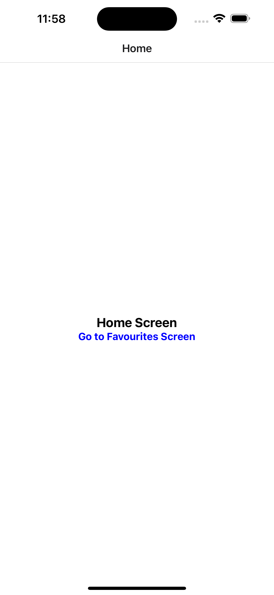
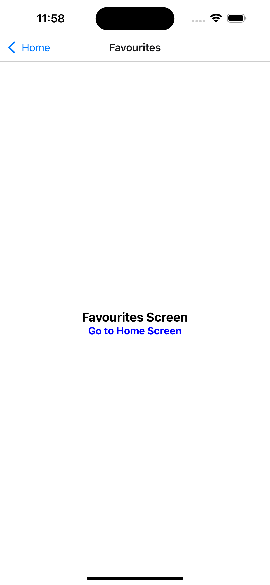
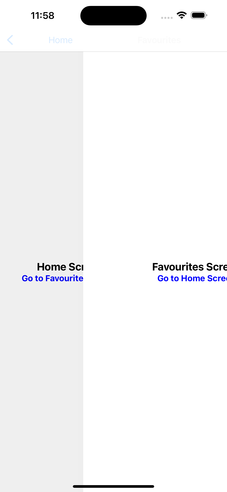
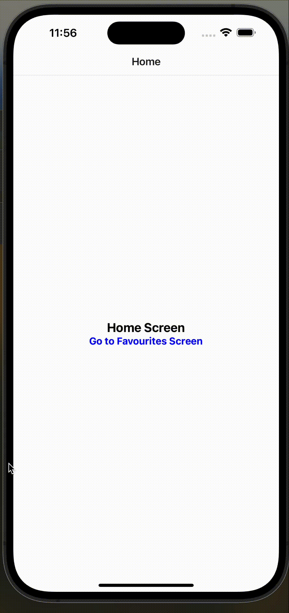
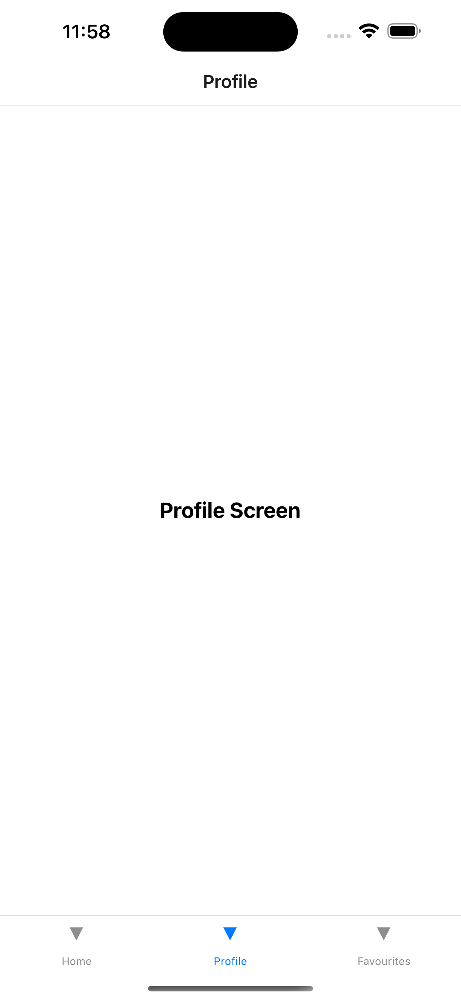
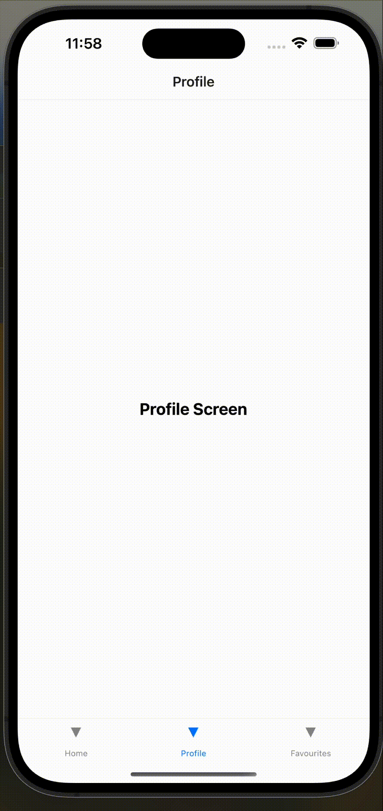
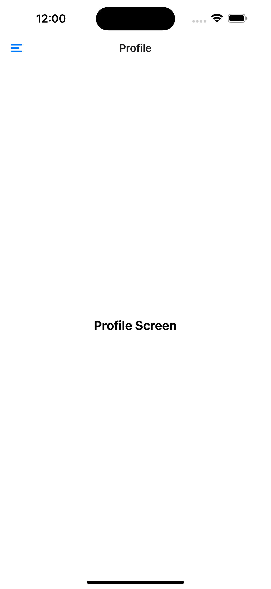
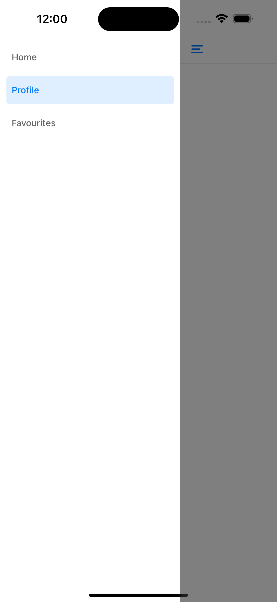

## 🧭 Navigation setup 

#### General setup
1. `npm install @react-navigation/native`
2. `expo install react-native-screens react-native-safe-area-context`

#### Stack Navigation setup steps
1. `npm install @react-navigation/native-stack`


<p align="center">




</p>

#### Tab Navigation setup steps
1. `npm install @react-navigation/bottom-tabs`
2. `npm install @expo/vector-icons` // note that this is optional, and it is only necessary if you would like those icons for the bottom tabs

<p align="center">


</p>

#### Drawer Navigation setup steps
1. `npm install @react-navigation/drawer`
2. `expo install react-native-gesture-handler react-native-reanimated`
3. Add the following plugin in `babel.config.js`:
```js
  ...
  return {
    ...
    plugins: [
      'react-native-reanimated/plugin',
    ],
  }
  ...
```

<p align="center">



</p>


[Extra Docs](https://reactnavigation.org/docs/getting-started/)