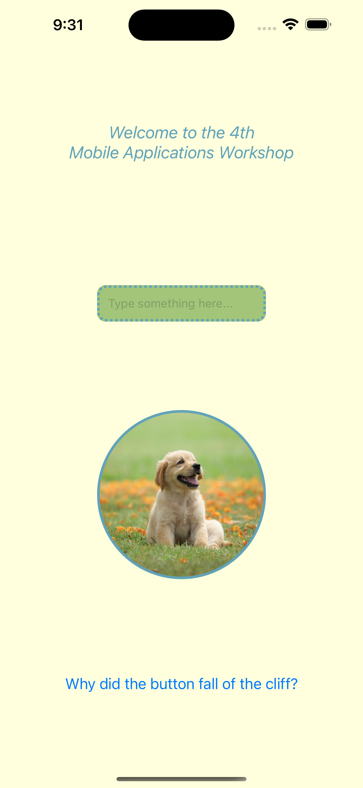
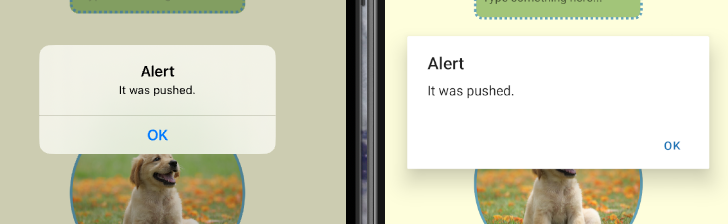

### 🖥️ Already existent components (React Native’s defaults & Expo SDK)

> Components are bits of code used to create React-Native applications. React-Native has some built-in components that can be used to create our app, such as `View`, `Text` and `Image`. React-Native already implements these components and can be used after we import them:
> ``` js
> import {Image, Text, View} from 'react-native';
> ```
> Styles can be applied using the `StyleSheet` library, which is an abstraction similar to CSS:
> ```js
>   <View style={styles.container}>
>     ...
>   <View>
> 
>   const styles = StyleSheet.create({
>     container: {
>      flex: 1,
>      backgroundColor: '#fff',
>      alignItems: 'center',
>      justifyContent: 'center',
>    },
>   });
> ```
> Build-in components can be used for creating new custom ones so that we can create what we envisioned. More build-in React-Native components we can find [here](https://reactnative.dev/docs/intro-react-native-components) and if that is not enough 
> 
> Expo provides a lot of components too, [here](https://docs.expo.dev/versions/latest/). We can take as an example the [checkbox](https://docs.expo.dev/versions/latest/sdk/checkbox/) component.

<p align="center">

</p>

### 👨‍💻Custom components

> React Native translates its code in native code and for that reason some components will look **different** on IOS vs Android. This leads to *inconsistent and unwanted behaviours*.

<p align="center">

</p>

> The solution to out problems is to "**do it ourselves**", so we create **custom** components. These are like cookies, we take basic ingredients and combine them to make the desired product. 
> 
> Let's take a look at an example based on some of the components we learned before, and then you can sharpen your skills doing some of these [components](https://dbeles.notion.site/Custom-components-e8657f810ada41af829a0a56910b095f).

<p align="center">

</p>